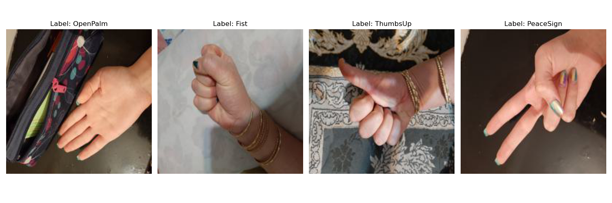
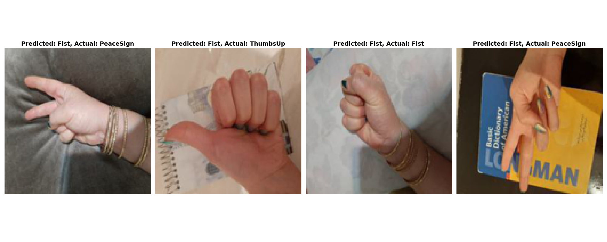

# HandGesture-Recognizer
This repository contains a custom dataset for Gesture Recognition, collected and curated personally. The dataset comprises 200 high-quality images, categorized into four hand gestures: Open Palm, Fist, Thumbs Up, and Peace Sign.

# Model Development
A CNN model was implemented and trained using the collected dataset. To ensure robustness and avoid overfitting, K-Fold cross-validation technique was employed during model training.

# Model Evaluation
After training, the model was evaluated on a separate test dataset. The evaluation results showed that the model achieved an accuracy of 50% on the test data.

